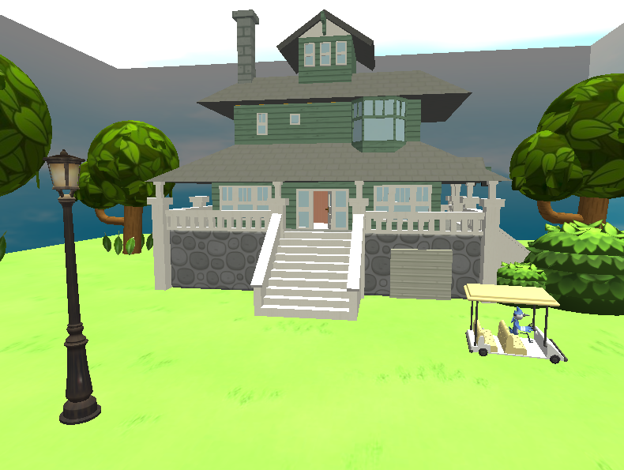
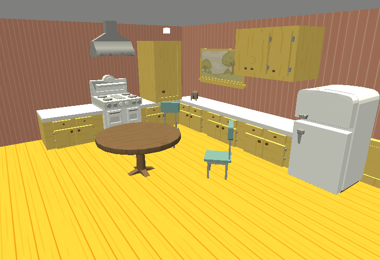
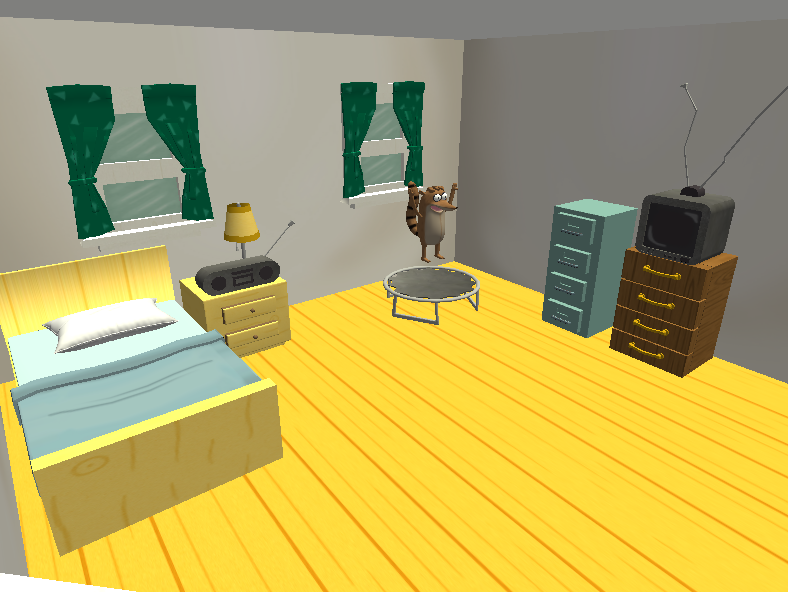

# 🏡 Proyecto Final - 3D Simulation of the Regular Show House

* **Authors:** Francisco Joshua Quintero Montero, Obed Torres Pimentel
* **Course:** Computer Graphics and Human-Computer Interaction (1590)
* **Institution:** National Autonomous University of Mexico - School of Engineering
* **Semester:** 2025-2
* **Professor:** Eng. Carlos Aldair Román Balbuena

---

## 📌 Description

This project is an immersive 3D simulation developed using **OpenGL** that faithfully recreates the house from *Regular Show*. It includes interactive navigation, dynamic lighting, spatial audio, and animations. Users can explore the **exterior and interior** (including kitchen and bedroom), interact with lights and sounds, and enjoy real-time effects like falling leaves, character animation, and day/night transitions.

---

## 🎮 Features

* 🏠 Explore a fully modeled house inspired by *Regular Show*
* 🎥 Free navigation with a controllable camera
* 💡 Toggle between day and night, and control individual light sources
* 🔊 Listen to spatial audio using a virtual radio
* 🎬 Real-time animations (cart drift, trampoline jump, wind on trees, falling leaves)
* 💻 Developed in C++ using OpenGL, GLFW, GLEW, SOIL2, OpenAL

---

## 🚀 Installation & Execution

1. Download the latest release: [Download Release.zip](https://github.com/joshuaqm/319098147_proyectoFinal_gpo05)
2. Extract the contents.
3. Run `ProyectoFinal.exe`.
4. Enjoy exploring the 3D environment!

> Ensure the folder structure and libraries remain intact for resource loading.

---

## 🕹 Controls

### Movement

| Key           | Action                       |
| ------------- | ---------------------------- |
| W / A / S / D | Move forward/left/back/right |
| Space         | Move up                      |
| Shift         | Move down                    |
| Ctrl + WASD   | Increase speed               |
| Mouse         | Look around                  |

### Lighting

| Key | Action                        |
| --- | ----------------------------- |
| N   | Toggle day/night mode         |
| L   | Toggle point lights           |
| F   | Toggle flashlight (spotlight) |

### Light Source Position (Kitchen)

| Key   | Action                |
| ----- | --------------------- |
| U / J | Move forward/backward |
| H / K | Move left/right       |
| ↑ / ↓ | Raise/lower light     |

### Audio

| Key | Action                 |
| --- | ---------------------- |
| M   | Play/pause radio audio |

---

## 🖥 Minimum System Requirements

**Hardware:**

* Intel Core i5 or AMD equivalent
* 8 GB RAM
* NVIDIA GTX 960+ with OpenGL 4.0+
* 1 GB of free disk space
* 1280x720 resolution

**Software:**

* Windows 10+ (64-bit)
* Required libraries included:

  * OpenGL 4.0+
  * GLFW
  * GLEW
  * SOIL2
  * OpenAL

---

## 📈 Development & Cost Summary

| Component            | Cost (MXN)   |
| -------------------- | ------------ |
| Development (60 hrs) | \$7,200      |
| Autodesk Maya        | \$5,000      |
| ChatGPT Plus         | \$400        |
| Hardware             | \$18,000     |
| Other Resources      | \$3,000      |
| **Total**            | **\$33,600** |

**Suggested sale price:** \$45,000 MXN (includes maintenance margin & value-added features)

---

## 📷 Preview

* 
* 
* 
*(See `/docs/` for full screenshots and comparisons)*

---

## 📚 References

Key assets and tools used are licensed under Creative Commons. Full list in [documentation](docs/References.md).

---

## ✅ Status

*✔️ Completed for academic submission
*🔧 Future ideas: More interaction, game-like elements

---

## 📄 License

Creative Commons Attribution 4.0 for external 3D models and textures used. Original code is property of the author.
